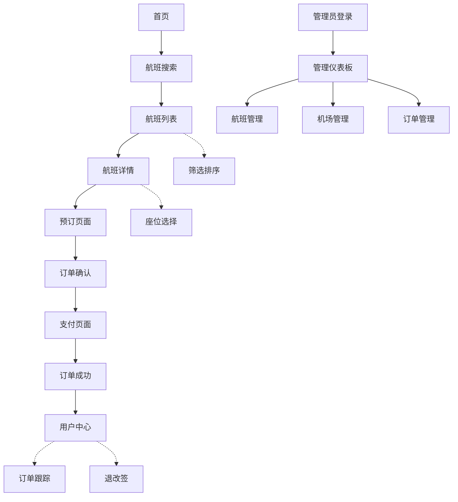

## 1. 产品概述
飞机票管理系统是一个全功能的在线航班预订平台，允许用户搜索、比较和预订航班机票。系统为乘客提供便捷的订票体验，同时为航空公司管理员提供完整的航班和订单管理功能。

目标用户包括需要预订航班的乘客和管理航班信息的航空公司工作人员，通过数字化流程简化传统机票预订的复杂性。

## 2. 核心功能

### 2.1 用户角色
| 角色 | 注册方式 | 核心权限 |
|------|----------|----------|
| 普通用户 | 邮箱注册/手机注册 | 搜索航班、预订机票、查看订单、管理个人资料 |
| 管理员 | 后台创建账号 | 管理航班信息、管理机场信息、查看所有订单、用户管理 |

### 2.2 功能模块
系统包含以下核心页面：
1. **首页**：航班搜索、热门航线推荐、系统导航
2. **航班列表页**：搜索结果展示、筛选排序、航班详情预览
3. **航班详情页**：航班详细信息、座位选择、价格展示
4. **预订页面**：乘客信息填写、联系方式、支付方式选择
5. **订单确认页**：订单详情确认、支付处理
6. **用户中心**：个人资料、订单历史、常用乘客管理
7. **订单管理页**：订单状态跟踪、退改签申请
8. **管理员仪表板**：数据统计、航班管理入口
9. **航班管理页**：航班信息CRUD、座位管理、价格调整
10. **机场管理页**：机场信息维护、航线管理

### 2.3 页面详情
| 页面名称 | 模块名称 | 功能描述 |
|----------|----------|----------|
| 首页 | 搜索模块 | 支持单程/往返选择、出发地目的地输入、日期选择、乘客数量设置 |
| 首页 | 热门航线 | 展示热门城市对航线、快速预订入口 |
| 航班列表页 | 搜索结果 | 展示符合条件的航班列表、显示价格、时间、航空公司信息 |
| 航班列表页 | 筛选器 | 按价格、时间、航空公司、中转次数筛选 |
| 航班详情页 | 航班信息 | 显示详细航班信息、机型、飞行时长、行李额度 |
| 航班详情页 | 座位选择 | 可视化座位图、可选座位标记、价格差异显示 |
| 预订页面 | 乘客信息 | 填写乘客姓名、证件信息、联系方式 |
| 预订页面 | 支付选择 | 支持多种支付方式、价格明细展示 |
| 订单确认页 | 订单详情 | 展示完整订单信息、航班信息、乘客信息、总价格 |
| 订单确认页 | 支付处理 | 集成支付网关、支付状态反馈 |
| 用户中心 | 个人资料 | 基本信息管理、证件信息管理、密码修改 |
| 用户中心 | 订单历史 | 历史订单列表、订单状态、详情查看 |
| 订单管理页 | 订单跟踪 | 实时订单状态、航班动态信息 |
| 订单管理页 | 退改签 | 退票申请、改签申请、手续费计算 |
| 管理员仪表板 | 数据统计 | 今日航班数、订单数、收入统计 |
| 航班管理页 | 航班维护 | 新增航班、编辑航班信息、设置座位布局 |
| 机场管理页 | 机场信息 | 机场基本信息、航站楼信息、航线关联 |

## 3. 核心流程

### 用户预订流程
用户访问首页 → 输入搜索条件 → 浏览航班列表 → 选择具体航班 → 填写乘客信息 → 选择支付方式 → 确认订单 → 完成支付 → 接收确认信息

### 管理员管理流程
管理员登录 → 进入管理后台 → 选择管理模块（航班/机场/订单）→ 执行相应操作（增删改查）→ 保存更改

## 4. 用户界面设计

### 4.1 设计风格
- **主色调**：蓝色系（#0066CC）体现航空主题，辅以白色和浅灰色
- **按钮样式**：圆角矩形设计，主要操作使用主色调，次要操作用边框样式
- **字体选择**：中文使用思源黑体，英文使用Inter，字号14-18px为主
- **布局风格**：卡片式布局，清晰的信息层级，充足的留白
- **图标风格**：使用Lucide React图标库，线性图标风格，统一尺寸

### 4.2 页面设计概览
| 页面名称 | 模块名称 | UI元素 |
|----------|----------|--------|
| 首页 | 搜索模块 | 大型搜索表单居中显示，城市选择使用下拉菜单，日期选择器支持范围选择 |
| 航班列表页 | 搜索结果 | 卡片式航班信息展示，包含航空公司logo、时间轴显示、价格突出显示 |
| 航班详情页 | 座位选择 | 网格状座位布局，已选座位高亮显示，不同舱位用颜色区分 |
| 预订页面 | 乘客信息 | 分步骤表单设计，支持添加多个乘客，实时验证输入格式 |
| 用户中心 | 订单历史 | 时间线式订单列表，状态标签明确，支持按状态筛选 |
| 管理仪表板 | 数据统计 | 图表展示关键指标，支持时间范围选择，数据卡片布局 |

### 4.3 响应式设计
采用桌面端优先的设计策略，确保在1920x1080分辨率下的最佳体验。同时适配平板（768px以上）和手机（320px以上）设备，关键功能在移动端保持完整可用性。触摸交互优化包括更大的点击区域、滑动操作支持。

## 5. 技术实现要点

### 5.1 搜索优化
- 实现智能搜索建议，支持城市名、机场代码联想
- 搜索结果缓存机制，减少数据库查询
- 支持多条件组合筛选，实时更新结果

### 5.2 实时数据
- 航班状态实时更新，使用WebSocket推送
- 座位库存实时同步，避免超售
- 订单状态及时通知用户

### 5.3 安全性考虑
- 用户敏感信息加密存储
- 支付流程PCI合规
- 管理员权限严格控制
- API接口防刷限流机制