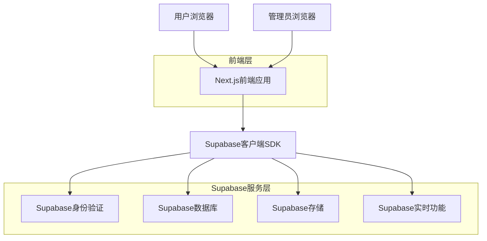
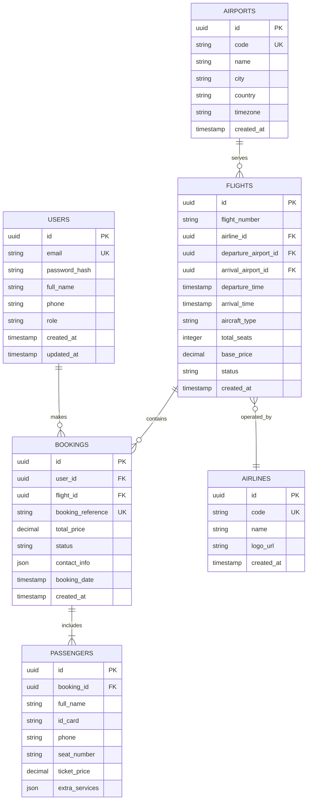

## 1. 架构设计



## 2. 技术描述

- **前端**: Next.js@14 + React@18 + Tailwind CSS@3 + Lucide React
- **初始化工具**: create-next-app
- **后端**: Supabase (BaaS - 后端即服务)
- **数据库**: Supabase PostgreSQL
- **身份验证**: Supabase Auth
- **文件存储**: Supabase Storage
- **实时功能**: Supabase Realtime

## 3. 路由定义

| 路由 | 用途 |
|------|------|
| / | 首页，航班搜索和热门航线展示 |
| /search | 航班搜索结果页面 |
| /flight/[id] | 航班详情页面 |
| /booking/[id] | 预订页面 |
| /booking/confirm | 订单确认页面 |
| /auth/login | 用户登录页面 |
| /auth/register | 用户注册页面 |
| /profile | 用户个人中心 |
| /orders | 订单管理页面 |
| /admin | 管理员仪表板 |
| /admin/flights | 航班管理页面 |
| /admin/airports | 机场管理页面 |
| /admin/orders | 订单管理后台 |

## 4. API定义

### 4.1 航班搜索API

```
POST /api/flights/search
```

请求参数：
| 参数名 | 参数类型 | 是否必需 | 描述 |
|--------|----------|----------|------|
| departure | string | true | 出发地机场代码 |
| arrival | string | true | 目的地机场代码 |
| departureDate | string | true | 出发日期 (YYYY-MM-DD) |
| returnDate | string | false | 返程日期 (YYYY-MM-DD) |
| passengers | number | true | 乘客数量 |
| tripType | string | true | 行程类型 (oneWay/roundTrip) |

响应示例：
```json
{
  "flights": [
    {
      "id": "flight_123",
      "flightNumber": "CA1234",
      "airline": "中国国际航空",
      "departure": {
        "airport": "PEK",
        "time": "2024-01-15T08:00:00Z"
      },
      "arrival": {
        "airport": "SHA",
        "time": "2024-01-15T10:30:00Z"
      },
      "price": 680,
      "duration": 150,
      "aircraft": "Boeing 737-800"
    }
  ]
}
```

### 4.2 预订创建API

```
POST /api/bookings/create
```

请求参数：
| 参数名 | 参数类型 | 是否必需 | 描述 |
|--------|----------|----------|------|
| flightId | string | true | 航班ID |
| passengers | array | true | 乘客信息数组 |
| contactInfo | object | true | 联系人信息 |
| paymentMethod | string | true | 支付方式 |

### 4.3 订单查询API

```
GET /api/bookings/[id]
```

响应示例：
```json
{
  "id": "booking_123",
  "flight": {
    "flightNumber": "CA1234",
    "departure": "2024-01-15T08:00:00Z",
    "arrival": "2024-01-15T10:30:00Z"
  },
  "passengers": [
    {
      "name": "张三",
      "idCard": "123456789012345678"
    }
  ],
  "totalPrice": 680,
  "status": "confirmed",
  "createdAt": "2024-01-10T12:00:00Z"
}
```

## 5. 数据模型

### 5.1 数据库表结构



### 5.2 数据定义语言

**用户表 (users)**
```sql
-- 创建用户表
CREATE TABLE users (
    id UUID PRIMARY KEY DEFAULT gen_random_uuid(),
    email VARCHAR(255) UNIQUE NOT NULL,
    password_hash VARCHAR(255) NOT NULL,
    full_name VARCHAR(100) NOT NULL,
    phone VARCHAR(20),
    role VARCHAR(20) DEFAULT 'user' CHECK (role IN ('user', 'admin')),
    created_at TIMESTAMP WITH TIME ZONE DEFAULT NOW(),
    updated_at TIMESTAMP WITH TIME ZONE DEFAULT NOW()
);

-- 创建索引
CREATE INDEX idx_users_email ON users(email);
CREATE INDEX idx_users_role ON users(role);
```

**机场表 (airports)**
```sql
-- 创建机场表
CREATE TABLE airports (
    id UUID PRIMARY KEY DEFAULT gen_random_uuid(),
    code VARCHAR(3) UNIQUE NOT NULL,
    name VARCHAR(255) NOT NULL,
    city VARCHAR(100) NOT NULL,
    country VARCHAR(100) NOT NULL,
    timezone VARCHAR(50) NOT NULL,
    created_at TIMESTAMP WITH TIME ZONE DEFAULT NOW()
);

-- 创建索引
CREATE INDEX idx_airports_code ON airports(code);
CREATE INDEX idx_airports_city ON airports(city);
```

**航空公司表 (airlines)**
```sql
-- 创建航空公司表
CREATE TABLE airlines (
    id UUID PRIMARY KEY DEFAULT gen_random_uuid(),
    code VARCHAR(2) UNIQUE NOT NULL,
    name VARCHAR(255) NOT NULL,
    logo_url TEXT,
    created_at TIMESTAMP WITH TIME ZONE DEFAULT NOW()
);
```

**航班表 (flights)**
```sql
-- 创建航班表
CREATE TABLE flights (
    id UUID PRIMARY KEY DEFAULT gen_random_uuid(),
    flight_number VARCHAR(10) NOT NULL,
    airline_id UUID REFERENCES airlines(id),
    departure_airport_id UUID REFERENCES airports(id),
    arrival_airport_id UUID REFERENCES airports(id),
    departure_time TIMESTAMP WITH TIME ZONE NOT NULL,
    arrival_time TIMESTAMP WITH TIME ZONE NOT NULL,
    aircraft_type VARCHAR(50),
    total_seats INTEGER DEFAULT 180,
    base_price DECIMAL(10,2) NOT NULL,
    status VARCHAR(20) DEFAULT 'scheduled' CHECK (status IN ('scheduled', 'delayed', 'cancelled', 'completed')),
    created_at TIMESTAMP WITH TIME ZONE DEFAULT NOW()
);

-- 创建索引
CREATE INDEX idx_flights_departure ON flights(departure_airport_id, departure_time);
CREATE INDEX idx_flights_arrival ON flights(arrival_airport_id, arrival_time);
CREATE INDEX idx_flights_number ON flights(flight_number);
```

**预订表 (bookings)**
```sql
-- 创建预订表
CREATE TABLE bookings (
    id UUID PRIMARY KEY DEFAULT gen_random_uuid(),
    user_id UUID REFERENCES users(id),
    flight_id UUID REFERENCES flights(id),
    booking_reference VARCHAR(8) UNIQUE NOT NULL,
    total_price DECIMAL(10,2) NOT NULL,
    status VARCHAR(20) DEFAULT 'pending' CHECK (status IN ('pending', 'confirmed', 'cancelled', 'completed')),
    contact_info JSONB,
    booking_date TIMESTAMP WITH TIME ZONE DEFAULT NOW(),
    created_at TIMESTAMP WITH TIME ZONE DEFAULT NOW()
);

-- 创建索引
CREATE INDEX idx_bookings_user ON bookings(user_id);
CREATE INDEX idx_bookings_flight ON bookings(flight_id);
CREATE INDEX idx_bookings_reference ON bookings(booking_reference);
CREATE INDEX idx_bookings_status ON bookings(status);
```

**乘客表 (passengers)**
```sql
-- 创建乘客表
CREATE TABLE passengers (
    id UUID PRIMARY KEY DEFAULT gen_random_uuid(),
    booking_id UUID REFERENCES bookings(id),
    full_name VARCHAR(100) NOT NULL,
    id_card VARCHAR(18) NOT NULL,
    phone VARCHAR(20),
    seat_number VARCHAR(5),
    ticket_price DECIMAL(10,2) NOT NULL,
    extra_services JSONB,
    created_at TIMESTAMP WITH TIME ZONE DEFAULT NOW()
);

-- 创建索引
CREATE INDEX idx_passengers_booking ON passengers(booking_id);
```

### 5.3 Supabase权限设置

```sql
-- 基本权限设置
GRANT SELECT ON airports TO anon;
GRANT SELECT ON airlines TO anon;
GRANT SELECT ON flights TO anon;

-- 认证用户权限
GRANT ALL PRIVILEGES ON bookings TO authenticated;
GRANT ALL PRIVILEGES ON passengers TO authenticated;
GRANT SELECT ON users TO authenticated;

-- 管理员权限
GRANT ALL PRIVILEGES ON airports TO authenticated;
GRANT ALL PRIVILEGES ON airlines TO authenticated;
GRANT ALL PRIVILEGES ON flights TO authenticated;

-- RLS (Row Level Security) 策略
ALTER TABLE bookings ENABLE ROW LEVEL SECURITY;
ALTER TABLE passengers ENABLE ROW LEVEL SECURITY;

-- 用户只能查看自己的预订
CREATE POLICY "Users can view own bookings" ON bookings
    FOR SELECT USING (auth.uid() = user_id);

-- 用户只能创建自己的预订
CREATE POLICY "Users can create own bookings" ON bookings
    FOR INSERT WITH CHECK (auth.uid() = user_id);
```

## 6. 关键技术实现

### 6.1 实时功能
使用Supabase Realtime实现：
- 航班状态实时更新
- 座位库存实时同步
- 订单状态变化通知

### 6.2 搜索优化
- 实现全文搜索索引
- 搜索结果缓存机制
- 地理位置查询优化

### 6.3 安全性
- JWT令牌认证
- API请求限流
- 敏感数据加密
- SQL注入防护

### 6.4 性能优化
- 数据库连接池
- 图片CDN加速
- 前端代码分割
- 服务端渲染优化